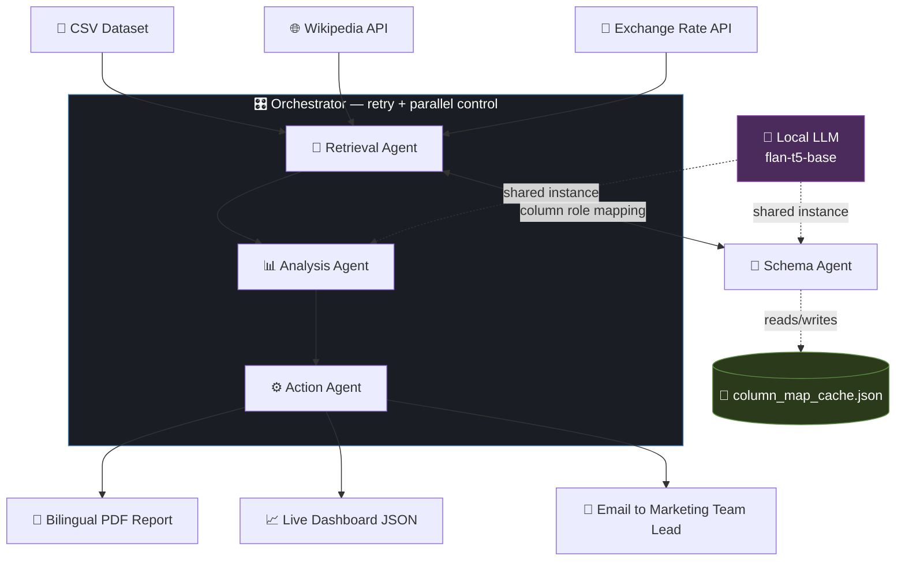
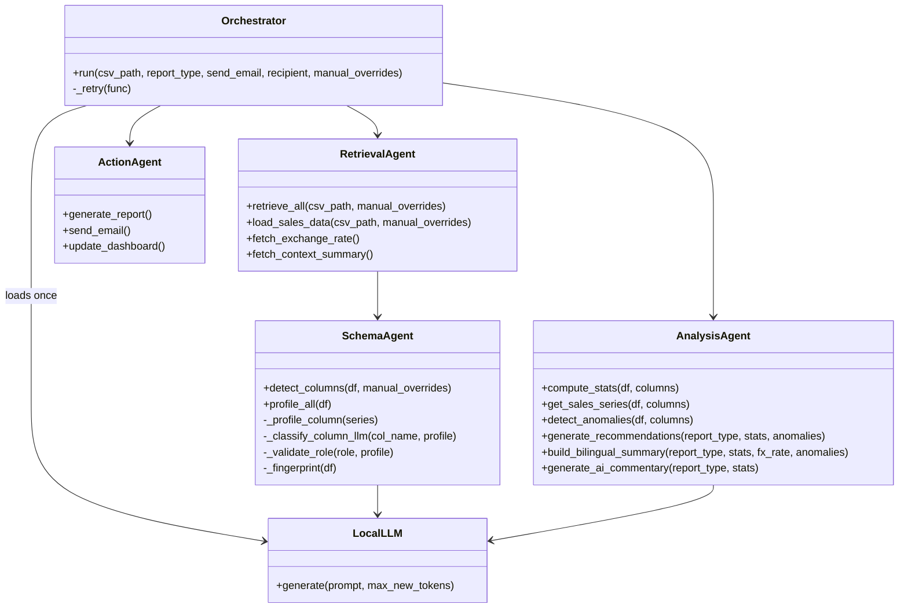
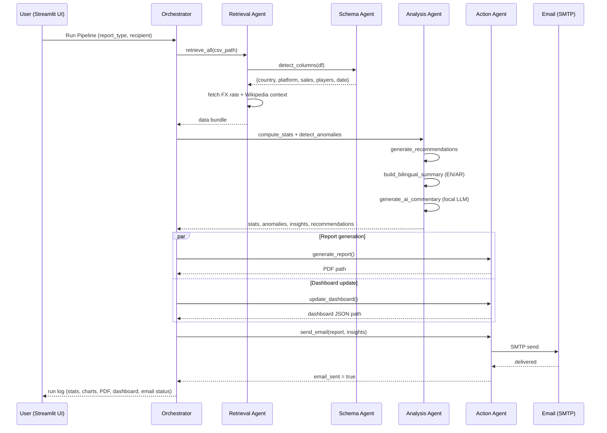
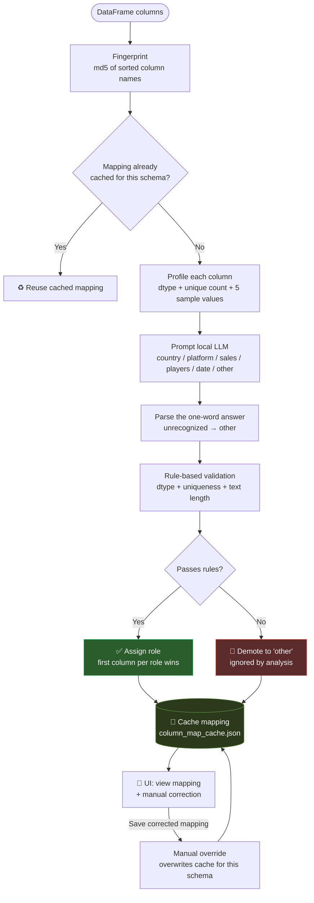
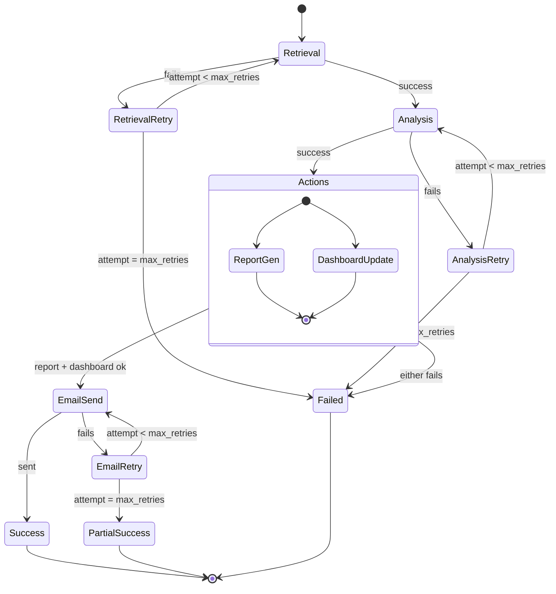
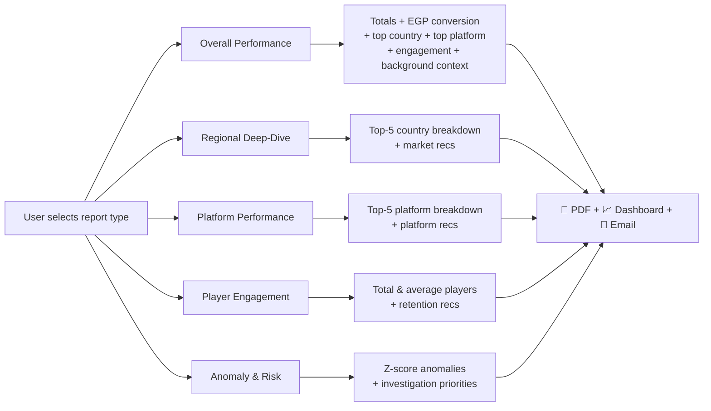
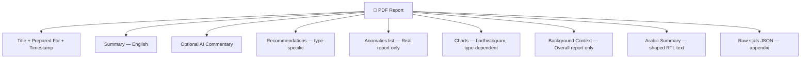
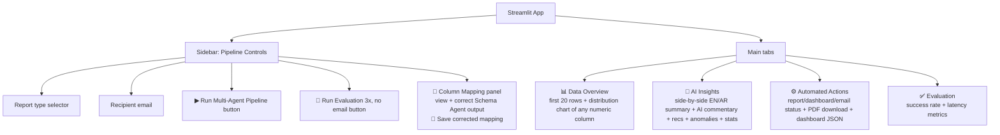
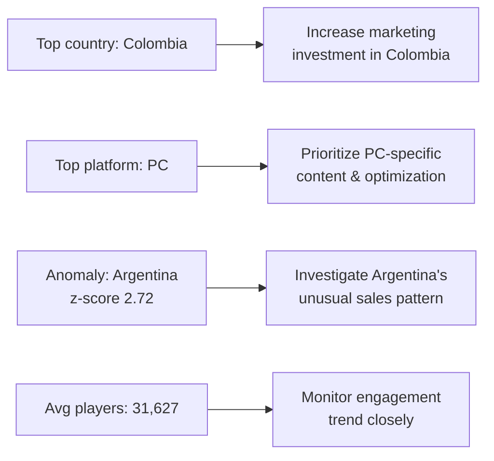

# 🎮 GTA V Worldwide Sales — Multi-Agent AI Analytics System

A fully orchestrated multi-agent AI system that retrieves, analyzes, and acts on video-game
sales data — built as a final project demonstrating end-to-end AI agent orchestration and
automation, with **zero paid LLM API calls**.


---

## 📑 Table of Contents

- [Overview](#-overview)
- [System Architecture](#-system-architecture)
- [The Agents](#-the-agents)
- [Pipeline Run Sequence](#-pipeline-run-sequence)
- [Schema Agent — Column Classification Logic](#-schema-agent--column-classification-logic)
- [Reliability Model — Retry & Parallel Execution](#-reliability-model--retry--parallel-execution)
- [Report Types & Content Structure](#-report-types--content-structure)
- [The UI](#️-the-ui)
- [Sample Output](#-sample-output)
- [Reliability & Testing](#-reliability--testing)
- [Tech Stack](#️-tech-stack)
- [Running It](#-running-it)
- [Dataset](#-dataset)
- [Possible Extensions](#-possible-extensions)
- [Author](#-author)
- [License](#-license)

---

## 📌 Overview

This project simulates a real-world marketing analytics workflow: a dataset lands, and instead
of a human manually pulling numbers into a slide deck, a coordinated team of AI agents does it —
retrieves the data, figures out what its columns actually mean, computes and interprets the
numbers, writes a bilingual report, charts it, and emails it to a decision-maker. Every run.

Built and demoed entirely in **Google Colab**, with a public **Streamlit** UI served through
**ngrok**.

---

## 🧠 System Architecture



**Design principles behind the pipeline:**
- **Sequential where order matters, parallel where it doesn't** — report generation and
  dashboard update fire concurrently via threads; retrieval → analysis → action stays sequential
  because each stage depends on the last.
- **Retry-with-backoff** wraps the retrieval, analysis, and email stages, so a transient failure
  (a flaky API call, a model hiccup, an SMTP timeout) self-heals instead of failing the whole run.
- **Fail loud, not silent** — a failed report or dashboard write marks the whole run as failed
  and the error message is captured into the run log, instead of being swallowed by a background
  thread.
- **One shared local LLM instance** — loaded once by the Orchestrator, used by both the Schema
  Agent (column classification) and Analysis Agent (AI commentary), rather than each agent
  loading its own copy.
- **Numbers are never generated by the model** — every figure in the report is formatted by
  Python; the LLM is only used for column classification and short qualitative commentary.

---

## 🤖 The Agents



| Agent | Responsibility | Key techniques |
|---|---|---|
| **Retrieval Agent** | Loads the CSV, fetches live USD→EGP FX rate, pulls Wikipedia background context | `requests`, live public APIs (exchangerate-api, Wikipedia REST) |
| **Schema Agent** | Figures out which column is `country`, `platform`, `sales`, `players`, `date` | Local LLM classifies each column from its name, sample values, and dtype; a **rule-based validator** (dtype, uniqueness ratio, text length) can veto any guess; the resulting mapping is **cached per dataset schema** and can be **corrected manually from the UI** |
| **Analysis Agent** | Computes stats, detects anomalies, writes the report content | pandas z-score anomaly detection on per-country and per-platform sales totals; **deterministic bilingual (EN/AR) templates** for every number (numbers are never machine-translated); optional qualitative AI commentary from `flan-t5-base` |
| **Action Agent** | Turns analysis into real outputs | `fpdf2` (bilingual PDF with embedded charts), `matplotlib`, SMTP email delivery, live dashboard JSON |
| **Orchestrator** | Coordinates all of the above | Retry-with-backoff, parallel thread execution, structured run logs |

---

## 🔁 Pipeline Run Sequence



---

## 🩺 Schema Agent — Column Classification Logic

Real-world datasets don't ship with predictable column names. Instead of hardcoding
`df["Country"]`, the Schema Agent classifies every column semantically with the local LLM, then
checks the answer against hard rules so that a hallucination from a small model can't slip into a
report:



**Hard validation rules** (the LLM's guess can never override these):
- `sales` and `players` must be **numeric** columns.
- `country` and `platform` must be **non-numeric**, have a **uniqueness ratio ≤ 0.5**, and short
  values (average sample length ≤ 40 characters) — this is what stops a numeric region-code or a
  free-text/ID column from being accepted as a country or platform.

This is the project's actual "learning" loop: not model retraining, but a persistent,
user-correctable memory of what each column means. The mapping is cached by schema fingerprint,
so the model is only consulted the first time a given set of columns is seen — and a manual
correction from the UI permanently overwrites the cached guess for that schema.

> ℹ️ The `date` role is detected and stored in the mapping, but the current statistics and reports
> do not use it yet (see [Possible Extensions](#-possible-extensions)).

---

## ♻️ Reliability Model — Retry & Parallel Execution



Retrieval, analysis, and email sending are each wrapped in `_retry` with a **linear backoff**
(`RETRY_BACKOFF_SECONDS * attempt` — 2s then 4s with the defaults, `MAX_RETRIES = 3`).
Report generation + dashboard update run as **parallel threads** since neither depends on the
other's output; any exception in either thread is captured and marks the run as failed. If the
email still fails after all retries, the run is reported with `email_sent = False` while the PDF
and dashboard are kept (partial success).

---

## 📊 Report Types & Content Structure



Every report — regardless of type — is addressed to the **Marketing Team Lead** and contains:



Chart selection per report type:

| Chart | Included in |
|---|---|
| Top countries by sales (bar) | Overall, Regional |
| Top platforms by sales (bar) | Overall, Platform |
| Sales distribution (histogram) | Overall, Engagement |

Reports are generated as a detailed PDF (summary, recommendations, anomalies where relevant,
charts, background context, Arabic translation), and **emailed automatically** on every run —
no manual send step. The email body carries the English and Arabic summaries with the PDF
attached, and the same content is written to `dashboard_state.json` (stats, insights, AI
commentary, anomalies, context, recommendations, timestamp).

---

## 🖥️ The UI



<!-- 📸 Add your own screenshots here once you have them, e.g.: -->
<!--  -->
<!--  -->
<!--  -->

---

## 🔎 Sample Output

**Live status messages shown in the UI during a run:**
```
🔎 Retrieval Agent: loading CSV (using learned column mapping) + FX rate + background context...
🧠 Analysis Agent: stats + anomalies + bilingual summary + AI commentary done.
⚙️ Action Agent: Overall Performance Report generated, email sent.
```

**Example anomaly output** (z-score ≥ 2.0 on per-country / per-platform sales totals, max 5 shown):

| Country/Platform | Group | Total Sales | Z-score |
|---|---|---|---|
| Argentina | country | 41,203.5 | 2.72 |

**Example recommendations output (Overall report):**



---

## ✅ Reliability & Testing

`evaluate.py` runs the full pipeline multiple times back-to-back (3 runs by default, no email
sent during testing) and reports:

- **Success rate** across runs
- **Average latency per stage** (retrieval / analysis / actions)

Every stage that can fail transiently (retrieval, analysis, email) is wrapped in
retry-with-backoff, and thread-level exceptions in report generation or dashboard updates are
captured into the run log instead of silently passing. Evaluation can be launched from the UI
(**🧪 Run Evaluation**) or directly with `python evaluate.py`.

```python
{
  'runs': 3,
  'success_rate': '3/3',
  'avg_seconds_per_step': {'retrieval': 0.4, 'analysis': 9.8, 'actions': 1.2}
}
```
*(Illustrative output — actual timings depend on the runtime and dataset size.)*

---

## 🛠️ Tech Stack

| Layer | Tools |
|---|---|
| Data | `pandas`, `requests` |
| Local LLM | `transformers` (`google/flan-t5-base`, deterministic decoding), `sentencepiece`, `sacremoses` — no paid API |
| Visualization | `matplotlib` (PDF charts), `plotly` (UI charts) |
| PDF generation | `fpdf2`, `arabic-reshaper`, `python-bidi`, Noto Naskh Arabic font (downloaded on first run) |
| UI | `streamlit` |
| Public demo hosting | `pyngrok` |
| Automation | `smtplib` (Gmail SMTP, App Password auth) |

---

## 🚀 Running It

Built and run entirely in **Google Colab** — see
[`notebook/Final_Project_Worof_Ahmed.ipynb`](notebook/Final_Project_Worof_Ahmed.ipynb) for the
full cell-by-cell setup.

1. Open the notebook in Colab.
2. Run the install cell (`pandas`, `streamlit`, `plotly`, `requests`, `matplotlib`, `fpdf2`,
   `transformers`, `sentencepiece`, `sacremoses`, `arabic-reshaper`, `python-bidi`, `pyngrok`).
3. Enter your Gmail App Password and ngrok auth token when prompted (never hardcode these) —
   they are read with `getpass` and stored only in environment variables.
4. Upload the dataset once to `/content/` as
   `gta_v_worldwide_sales_player_analytics_2013_2026.csv`.
5. Run the agent-file cells (`%%writefile` cells build `config.py`, `agents/`, `orchestrator.py`,
   `evaluate.py`, and `app.py`).
6. Run the cleanup cells (clears any stale `column_map_cache.json`, stops old Streamlit/ngrok
   processes), then the launch cell starts Streamlit + ngrok and prints a public URL.
7. Optionally run the last cell (`!python evaluate.py`) to test reliability from the command line.

### Configuration (`config.py`)

| Setting | Purpose |
|---|---|
| `EMAIL_ADDRESS`, `EMAIL_APP_PASSWORD`, `RECIPIENT_EMAIL` | Gmail SMTP sender, App Password, and default recipient (read from environment variables) |
| `DEFAULT_CSV_PATH` | Dataset location (`/content/...` in Colab) |
| `LLM_MODEL_NAME` | Local model (`google/flan-t5-base`) |
| `ANOMALY_ZSCORE_THRESHOLD`, `MAX_RETRIES`, `RETRY_BACKOFF_SECONDS` | Anomaly sensitivity and retry behaviour |
| `COLUMN_MAP_CACHE_PATH` | Where the learned column mapping is stored |
| `REPORT_TYPES`, `PREPARED_FOR` | Report titles (EN/AR), email subjects, and addressee |

### Running locally instead
```bash
git clone https://github.com/Worof/gta-v-multi-agent-analytics.git
cd gta-v-multi-agent-analytics
python -m venv venv
source venv/bin/activate   # Windows: venv\Scripts\activate
pip install -r requirements.txt
streamlit run app.py
```
You'll still need a Gmail App Password (`EMAIL_APP_PASSWORD` env var, plus `EMAIL_ADDRESS` and
`RECIPIENT_EMAIL`) for the email step, and the dataset placed at the path set in `config.py`
(`DEFAULT_CSV_PATH` points to a Colab path by default, so update it for local use).

---

## 📂 Dataset

[GTA V Worldwide Sales and Player Analytics](https://www.kaggle.com/datasets/crystalbaby/gta-v-worldwide-sales-and-player-analytics)
(Kaggle) — worldwide sales figures and player engagement metrics.

---

## 🔮 Possible Extensions

- Swap `flan-t5-base` for a larger local model on a GPU runtime for richer AI commentary
- Harden the Schema Agent with dual-prompt voting (two independently-worded few-shot prompts),
  a keyword-heuristic tiebreaker, and a `needs_review` flag for unresolved columns
- Use the detected `date` column for time-series trends in the engagement report
- Add a second file-based retrieval source (PDF ingestion) alongside the CSV + APIs
- Persist historical dashboard snapshots to chart trend-over-time, not just latest run
- Add a lightweight embeddings-based Q&A agent over the dataset rows

---

## 👤 Author

**Worof Ahmed** — Marketing Data Scientist & Content Team Lead
[GitHub](https://github.com/Worof) · Building AI agents for marketing and content systems.

---

## 📄 License

MIT — see [LICENSE](LICENSE).
